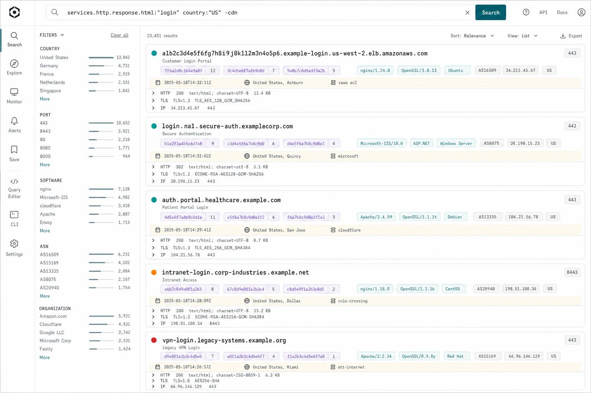

## 14.1 SvelteKit, and the reason is not comfort

The console is **SvelteKit**, in `web/`, served by its own process.

What the interface has to do decides this better than a comparison of frameworks. There is one page that
matters, it is entirely dynamic, and its state is a filter tree that three things modify: the facets, the
badges on a row, and cursor pagination. That is client state, not a document.

Three alternatives were rejected, and only one of the reasons is structural:

- **Server templates served by the control plane.** This is the only option that would put the rendering of
  the interface **inside the process holding the database credentials**.
  [9.4](/architecture/deployment/#94-separating-privilege-not-just-load) refuses exactly that for the
  fingerprinter, and the argument does not depend on what the component does: a process that renders pages and
  holds write access to the inventory is one bug away from being the whole system. That is a refusal, not a
  preference.
- **Astro**, already the tool used for these docs. One frontend ecosystem in the repository would be a real
  gain, but Astro is a content tool and the console has no content.
- **A static single page app** would have done, except for the detail that decides the next section: a static
  bundle has no server, therefore nowhere to keep a secret.

**What the console does not hold**: no database credential, no signing key. It reaches the control plane over
HTTP with the token of [11.1](/architecture/security/#111-irreversible-decisions), like any other API client.
The list is short because it is the useful half of the choice above.

## 14.2 The credential: a token pasted once

The credential is already settled: an `api_token` that belongs to the organization. So this adds **no** second
identity system. It decides where that token is kept.

One screen asks for it once. The SvelteKit server puts it in an **`httpOnly`, `SameSite=Lax`, `Secure`** cookie
and the browser never sees it again. Not `localStorage` and not `sessionStorage`: both are readable from any
script on the page, and an interface that displays titles and headers collected from hostile targets is the
last place to bet that no XSS will ever happen.

**The consequence is that the console is a proxy.** Since the browser carries no credential, every call goes
through the console's server, which adds the `Authorization` header and forwards. Including
[the export](/architecture/search/#108-export), which streams through rather than being accumulated: the export
is forbidden from materializing the inventory before sending it, and a buffering proxy would cancel that
property at the exact place it was built.

`SameSite=Lax` is what makes the cookie usable in front of a POST API. The search endpoints are POSTs because
[the query is a tree](/architecture/search/#101-three-principles), and an authentication cookie in front of a
POST API is a CSRF vector when nothing bounds it. `Lax` sends the cookie only on a top level GET navigation,
which closes the case without a CSRF token to rotate.

**What this costs, written here so it is not rediscovered later**: the token belongs to the organization, so the
console **does not know who is acting**. The `app_user` and `membership` attribution columns exist and will stay
empty as far as the console is concerned until a login exists. That has to be said, because an attribution column
believed to be populated is worse than an absent one.

This is not a login: no password, no session table, no `app_user` row involved. A local login is not forbidden,
but it would add a secret store to protect for a single user. Revocation is the token's, and
`api_token.revoked_at` exists from the first migration.

### The origin check

**`ORIGIN` is required in production, and startup fails without it.** The Node adapter compares the `Origin`
header of a POST against the origin it believes it serves, and without that variable it infers it badly: it then
rejects **legitimate** POSTs, the login screen included. The fault does not show at startup but at the first
form, which is the worst moment.

Two things learned by exercising it, which appear to contradict each other:

- **Origin protection only exists in a production build.** It lives entirely inside a development guard, so a
  cross-origin POST passes under the dev server. A local test against the dev server demonstrates nothing.
- **Verifying it means making it fail.** A POST from another origin and a POST with no `Origin` header must both
  answer 403, against 200 for the same form in same origin. That last one is the positive control, without which
  both refusals would pass on a console that refuses everything.

## 14.3 What the console does not decide

It displays what it receives. Three rules live server side and have no client half:

- The [genericity denylist](/architecture/search/#the-genericity-filter) and the counter-of-1 guardrail are
  applied by the search layer. A second filter in the console would be a second list to keep in step, and the
  divergence would read as a badge appearing on one side and not the other. The same reasoning bounds what
  travels: a value that goes over the wire is paid for whatever the client does with it, so the projection sent
  to the list carries what a row draws, and the asset view asks for everything.
- The tenant. The console never sends an `org_id` and could not:
  [the AST has no field to express it](/architecture/search/#103-the-compiler-and-what-it-does-not-delegate).
- The scope. A rule is changed through the API, and the server reclassifies.

Two things the console asks the control plane for, beyond data, because it cannot deduce either:

**What this deployment can do.** Today that means whether Geo-IP enrichment is configured. A deployment without
a MaxMind database is normal, and the console must then **not display** the infrastructure family rather than
show an empty one. It cannot deduce the state from the data, since "not configured" and "configured with no
match" both give zero ASNs.

**The state of the queue.** Nothing in an asset says whether it is waiting for a render, held by a run, or no
longer scheduled at all ([9.9](/architecture/deployment/#99-reading-the-queue)).

## 14.4 Art direction

The direction is settled and worth keeping. Two rules found the hard way and cheap to hold:

- **Every icon is an inline SVG with a viewBox and no intrinsic size**, and one of those fills whatever box it
  lands in. The base size is set once, so a missing context rule costs a wrong size and never a full-card arrow.
- **Rounded cards over sharp controls.** The radii are tokens, because mixing the two by hand is what makes an
  interface look assembled.

| Token | Value | Use |
|---|---|---|
| `--signal` / `--signal-bg` | `#06c68a` / `#e0f8ef` | the accent, and the switcher swatch |
| `--canvas` / `--card` | `#f4f5f6` / `#ffffff` | grey ground, white floating cards |
| `--ink` / `--ink-2` / `--ink-3` | `#141719` / `#4a5257` / `#7b858b` | text, secondary, tertiary |
| `--border` / `--border-2` | `#e4e7e9` / `#eef0f1` | separators |
| `--radius-card` / `--radius-control` | `14px` / `3px` | the rule above, as values |
| `--code-2xx` … `--code-5xx` | `#04a870`, `#2f7fe4`, `#c07d16`, `#e5484d` | status chips, each with its own background |
| `--cdn` / `--cdn-bg` | `#7c5cff` / `#efeaff` | the CDN chip |
| `--dead` | `#a8b0b5` | an `inactive` row, desaturated |
| `--unobs` / `--unobs-bg` | `#b06ad8` / `#f6ecfc` | `unobservable`, and it is **not a shade of dead** |
| `--temporal-bg` | `#fbf9f2` | the temporal band |
| `--font-sans` / `--font-mono` | Space Grotesk / JetBrains Mono | interface, and every piece of data |

The `--unobs` line is the one to protect. One is an absence of measurement and the other is a measurement
([10.7](/architecture/search/#unobservable-and-inactive-each-say-a-sentence)), so making the second a lighter
version of the first would say in colour the opposite of what the page says in words.

**The login screen keeps the base palette.** The direction above is scoped to the application shell, so the two
share tokens without the login inheriting a treatment designed for dense data.

Shared chip classes live in one layer rather than being reinvented per screen: the status pill, the CDN chip, the
status code chip keyed on its class, and the clickable pivot chip. The tables share one class, so a screen added
later inherits the density instead of approximating it.

## 14.5 Copy

**The interface is in English**, and that is worth a line precisely because nothing around it gives it away.

Microcopy follows the same rules as this document. No em dashes in prose; a period, a comma, a colon or
parentheses instead. The one exception is the empty value glyph in a table, which is a data placeholder and not
prose. Sentence case in headings. No stock vocabulary, no promotional phrasing, no generic positive endings. A
label states a fact and stops.

Page titles use a middot as the separator, matching the separators the interface already uses elsewhere.
